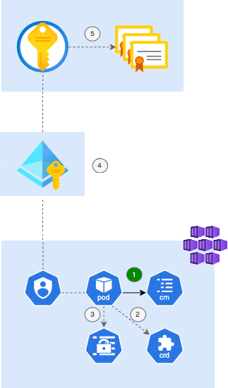

<div style="text-align: center;">
  
</div>


# cert-manager-kv-syncer

## Overview
The tool automates the synchronization of TLS certificates from Kubernetes Secrets to Azure Key Vault, ensuring consistency across environments. The primary goal is to synchronize certificates generated by [cert-manager](https://github.com/cert-manager/cert-manager), ensuring they are always up-to-date in Key Vault.

### How it works
* **Scanning for Certificate CRD**: The tool periodically scans Kubernetes for `Certificate` resources created by cert-manager in the configured namespaces. It retrieves the associated TLS secrets containing certificate and key data.
* **Determining target name & tags**: Based on the configuration (`USE_NAME_MAPPING`, `STRICT_NAME_MAPPING`), the tool determines the correct certificate name and associated metadata (tags) before uploading it to Key Vault.
* **Checking for existing certificates**: Before uploading, the tool queries Azure Key Vault to check if the certificate already exists. It compares the stored fingerprint with the new certificate to prevent unnecessary updates.
* **Uploading certificates**: If a new or updated certificate is detected, it is converted into the correct format and securely uploaded to Azure Key Vault. Tags are assigned based on the provided configuration or default.
* **Continuous synchronization**: The process runs continuously based on the `SYNC_INTERVAL` value, ensuring all certificates remain synchronized between Kubernetes and Azure Key Vault.

### Modes
This tool can be run both in Azure Kubernetes Service (AKS) and locally.

* **Running in AKS** is intended for production deployments and standard usage in a cloud environment.
* **Local execution** is suitable for one-time operations, testing, or use in a home lab etc.

This flexibility allows the tool to adapt to different deployment scenarios.



_Note_: AKS running diagram

## Features
- **Automatic synchronization** – Periodically syncs Kubernetes secrets to Azure Key Vault.
- **Multiple Key Vault support** – Can be configured to work with different Key Vaults.
- **Namespace filtering** – Define where to search for certificates using `SEARCH_NAMESPACES`.
- **Exclusion support** – Exclude namespaces using `!namespace` syntax.
- **Custom certificate mapping** – Rename certificates before storing them in Key Vault.
- **Tag management** – Assign custom tags to Key Vault certificates.
- **Dry Run mode** – Test without making real changes (`DRY_RUN=True`).
- **Configurable sync interval** – Control how often sync runs (`SYNC_INTERVAL`).
- **Automatic environment detection** – Runs seamlessly both locally and inside AKS.

## Usage

### AKS

#### Identity and permissions

The necessary Azure CLI steps to configure the identity and permissions required for cert-manager-kv-syncer to access Key Vault in the subscription:

- Authenticate and set the correct Azure subscription
- Create a User-Assigned Managed Identity
- Assign the identity the necessary permissions to manage Key Vault certificates
- Enable OIDC authentication between AKS and Azure AD
- Link the Kubernetes service account with the managed identity for secure authentication
  
```sh
# Create a User-Assigned Managed Identity
az identity create --name cert-manager-kv-syncer-umi \
  --resource-group my-resource-group \
  --location westeurope

# Retrieve the Client ID of the identity
az identity show --resource-group my-resource-group \
  --name cert-manager-kv-syncer-umi \
  --query clientId -o tsv

# Assign Key Vault Certificates Officer role to the identity
az role assignment create \
  --assignee <CLIENT_ID> \
  --role "Key Vault Certificates Officer" \
  --scope "/subscriptions/<SUBSCRIPTION_ID>/resourceGroups/my-resource-group/providers/Microsoft.KeyVault/vaults/my-keyvault"

# Retrieve the OIDC Issuer URL for the AKS cluster
az aks show -g my-aks-resource-group \
  -n my-aks-cluster \
  --query "oidcIssuerProfile.issuerUrl" -o tsv

# Create a federated credential for AKS service account authentication
az identity federated-credential create \
  --name "cert-manager-kv-syncer-federation" \
  --identity-name cert-manager-kv-syncer-umi \
  --issuer https://westeurope.oic.prod-aks.azure.com/<TENANT_ID>/<OIDC_PROVIDER_ID>/ \
  --subject "system:serviceaccount:cert-manager-kv-syncer:cert-manager-kv-syncer" \
  --resource-group my-resource-group
```

#### Instalation

To install the syncer, run:

```sh
helm install cert-manager-kv-syncer cert-manager-kv-syncer \
  --values cert-manager-kv-syncer/values.yaml \
  --namespace cert-manager-kv-syncer \
  --create-namespace
```
This command installs the syncer in the cert-manager-kv-syncer namespace using the provided configuration values.

##### Upgrade

Upgrades and installs in case it does not exist.

```sh
helm upgrade --install cert-manager-kv-syncer cert-manager-kv-syncer \
  --values cert-manager-kv-syncer/values.yaml
```


The tool can also be run locally without the need for Helm installation. This allows for manual synchronization by simply executing the script, making it useful for on-demand certificate updates or debugging purposes.

### Local

#### Prerequisites
- **Python 3.11+**
- **Kubernetes Access** – Ensure you have a working `kubeconfig`.
- **Azure Key Vault Access** – Configure authentication using `DefaultAzureCredential`.

#### Instalation

```bash
# Clone the repository
git clone https://github.com/jiriwetter/cert-manager-kv-syncer.git
cd cert-manager-kv-syncer/app

# Create and activate a virtual environment
python3 -m venv venv
source venv/bin/activate  # On macOS/Linux

# Install dependencies
pip install -r requirements.txt
```

#### Configuration

##### Basic Variables

| Variable                  | Default                                               | Description                                                                                                                                                                    |
|---------------------------|-------------------------------------------------------|--------------------------------------------------------------------------------------------------------------------------------------------------------------------------------|
| `SYNC_INTERVAL`           | `300`                                                 | Sync interval in seconds                                                                                                                                                       |
| `SEARCH_NAMESPACES`       | `""`                                                  | Namespaces to search (`"ingresscontrollers,production"` or `"!production"` or `""` for all)                                                                                    |
| `USE_NAME_MAPPING`        | `True`                                                | Maps AKS secret names to custom Azure Key Vault certificate names using a predefined matrix. Those without mapping set will be transferred with the same name and default tag. |
| `STRICT_NAME_MAPPING`     | `True`                                                | Only sync mapped certificates. Requires all secrets to have a defined mapping; otherwise, they will not be synchronized.                                                       |
| `DEFAULT_TAGS`            | `{created-by: cert-manager-kv-syncer}`                | Tags applied to certificates. Currenctly hardcoded.                                                                                                                            |
| `DRY_RUN`                 | `False`                                               | Allows testing the synchronization process without making actual changes.                                                                                                      |
| `CERTIFICATE_CONFIG_PATH` | `/etc/cert-manager-kv-syncer/certificate-config.json` | Path to the name mapping matrix between AKS and Key Vault                                                                                                                      |


#### Usage

##### Run the script

Format example for mapping and tag settings referenced later in `certificate-meta-config.json`
```json
{
  "cert-manager-generated-secret-name": {
    "keyVaults": [
      "https://common-kv.vault.azure.net/",
      "https://backup-kv.vault.azure.net/"
    ],
    "cert_name": "certificate-name-in-keyvault",
    "tags": {
      "owner": "name@example.com",
      "team": "team"
    }
  }
}
```

##### Example: Preparing env file for specific environment and Key Vault
```bash
#!/usr/bin/env bash
export USE_NAME_MAPPING=true
export STRICT_NAME_MAPPING=true
export CERTIFICATE_CONFIG_PATH="env-specific-certificate-meta-config.json"
export SYNC_INTERVAL=300
export DRY_RUN=false
```
Always make sure you are connected to the correct AKS cluster before running the syncer!

```bash
source env.sh
python cert-manager-kv-syncer.py
```

##### Example: Search in all namespaces except `kube-system`
```bash
export SEARCH_NAMESPACES="!kube-system"
```

##### Example: Use name mapping with strict mode
```bash
export CERTIFICATE_CONFIG_PATH=certificate-meta-config.json
```

##### Example: No mapping - sync all
```bash
export USE_NAME_MAPPING=False
export STRICT_NAME_MAPPING=False
```

##### Example: Use name mapping without strict mode
```bash
export USE_NAME_MAPPING=True
export STRICT_NAME_MAPPING=False
```

### Logs & Debugging
By default, logs are at `INFO` level. To enable debug mode:
```bash
export DEFAULT_LOGGING_LEVEL=DEBUG
```

### Planned Features
- **Notifications** – Alerts via Slack, Teams, or email when certificates are updated.
- **Automatic cleanup** – Remove stale certificates from Key Vault.
- **Audit logging** – Store sync history in a database.

### Contributing
1. Fork the repository
2. Create a feature branch
3. Commit changes & submit a PR

### License
MIT License

